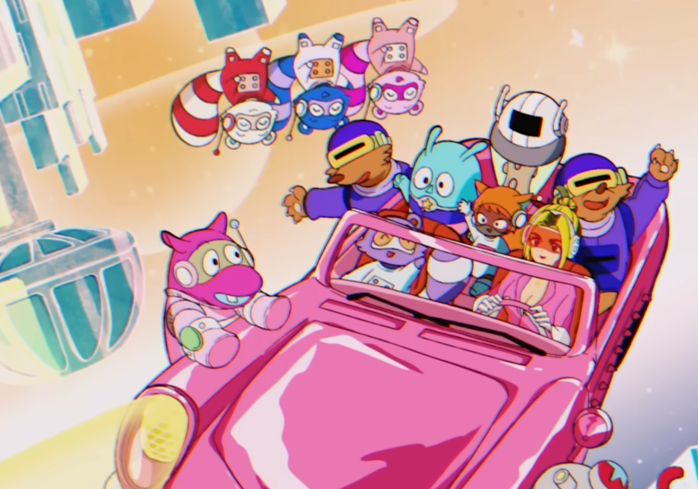
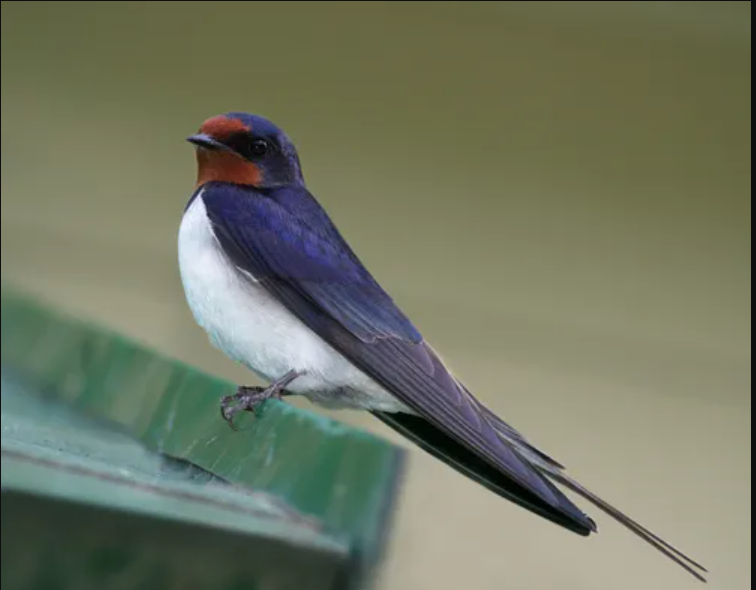

블로그를 세팅하면서 가장 고민했던 것 중 하나는 바로 **'나를 대표하는 프로필 아이콘을 무엇으로 할까?'**&#8203;였습니다. 흔한 `.ico`나 `.png` 대신, 요즘 웹 트렌드에 맞춰 아무리 확대해도 깨지지 않는 무한 해상도의 `.svg`로 나만의 마스코트를 만들어보기로 했습니다.

## 영감 찾기: 90년대 셀 애니메이션과 우주

저는 "게임과 애니메이션을 좋아하는 개발자"라는 정체성을 담고 싶었습니다. 너무 딱딱한 개발자 느낌보다는, 친근하면서도 몽환적인 감성을 원했죠. 

영감을 준 것은 바로 [Dua Lipa의 *Levitating*](https://www.youtube.com/watch?v=N000qglmmY0) 공식 애니메이션 뮤직비디오였습니다.

뮤직비디오 2분 23초 쯤에 나오는 파스텔톤 우주와 90년대 셀 애니메이션 감성! 이 느낌을 살려 저의 상징인 '제비'에 개발자의 아이템인 '헤드셋'을 씌운 **일명 "효제비(헤드셋 쓴 제비)"**&#8203; 컨셉을 잡았습니다. 이미지는 나노바나나로 생성했습니다.

프롬프팅을 위해서 2개의 이미지를 첨부했습니다. 

## Aseprite: 픽셀로 감성 깎아내기

애니메이션의 부드러운 선을 웹용 로고에 그대로 가져가기엔 무리가 있습니다. 그래서 선택한 방법은 **픽셀 아트(Pixel Art)**&#8203;입니다. 레트로 게임 감성이 개발 블로그와 찰떡궁합이거든요.

픽셀 아트를 찍기 위해 Aseprite를 켰습니다.

1. **정사각형으로 자르기 (Crop):** 비율이 무너지지 않도록 `M` (Rectangular Marquee) 툴로 `Shift`를 누른 채 완벽한 정사각형 영역을 잡고 잘라냅니다.
2. **해상도 축소:** 64x64 사이즈의 캔버스로 줄입니다.

:::important
해상도를 줄일 때 `Sprite > Sprite Size`에서 보간(Interpolation) 옵션을 반드시 **Nearest-neighbor(최근접 이웃)**&#8203;로 설정해야 합니다. 그래야 픽셀이 흐릿하게 뭉개지지 않고 선명하게 줄어듭니다!
:::

### 마법의 1000% 뻥튀기

이제 이 도트 이미지를 SVG로 변환해야 하는데, 여기서 픽셀 아티스트들의 비법이 하나 들어갑니다. 작은 이미지를 그대로 벡터 툴에 넣으면 모서리가 둥글게 깎여버립니다.

이를 방지하기 위해 Aseprite에서 내보내기(Export)를 할 때 **Resize를 1000%**&#8203;로 설정하여 거대한 PNG 파일로 저장해 줍니다. 

## Inkscape: 완벽한 네모 픽셀을 SVG로 굽기

이제 뻥튀기한 이미지를 무료 벡터 그래픽 툴인 잉크스케이프(Inkscape)로 불러옵니다.

1. 이미지를 선택하고 `경로(Path) > 비트맵 추적(Trace Bitmap)`을 엽니다.
2. **Multicolor (다색)** 탭을 선택합니다.

:::caution
픽셀 아트 전용 탭(`Pixel art`)이나 `B-splines` 옵션을 쓰면 고전 게임 같은 도트가 둥근 슬라임처럼 변해버립니다. 우리는 "각진 네모"를 원하므로 이 옵션들은 피해야 합니다.
:::

가장 중요한 설정은 아래의 '스무딩(부드럽게)' 관련 옵션을 **전부 끄는 것**&#8203;입니다.

* `Smooth corners` (모서리 부드럽게) ➡️ **체크 해제**
* `Optimize` (최적화) ➡️ **체크 해제**
* `Speckles` (반점) ➡️ **체크 해제**

`Apply(적용)`를 누르면 원본 이미지 위에 벡터 이미지가 겹쳐서 생성됩니다. 겹쳐진 원본 이미지를 치우고 삭제해 주면 끝입니다.

### 웹용으로 다이어트 시키기

마지막으로 이 로고를 웹사이트에 띄우기 위해 최적화된 저장을 해야 합니다.

1. `File > Document Properties`에서 `Resize to content` 버튼을 눌러 쓸데없는 투명 여백을 싹 잘라냅니다.
2. `Save As...`를 눌러 파일 형식을 **Optimized SVG (*.svg)**&#8203;로 선택합니다.
3. 저장 시 뜨는 옵션 창에서 불필요한 에디터 데이터는 빼고, 색상 코드를 짧게 줄이는 옵션을 그대로 둔 채 `OK`를 누릅니다.

## 완성!

이렇게 해서 모니터만 한 크기로 확대해도 절대 깨지지 않고 픽셀 감성이 살아있는 나만의 `.svg` 프로필 마스코트가 완성되었습니다. 

Aseprite에서 크게 뻥튀기하고 Inkscape에서 스무딩 옵션을 끄고 벡터화하는 이 워크플로우는, 도트 로고를 웹에 올리려는 분들이라면 꼭 기억해 두시면 좋을 꿀팁입니다!
